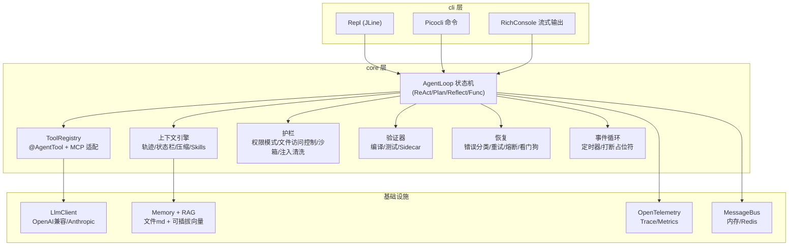
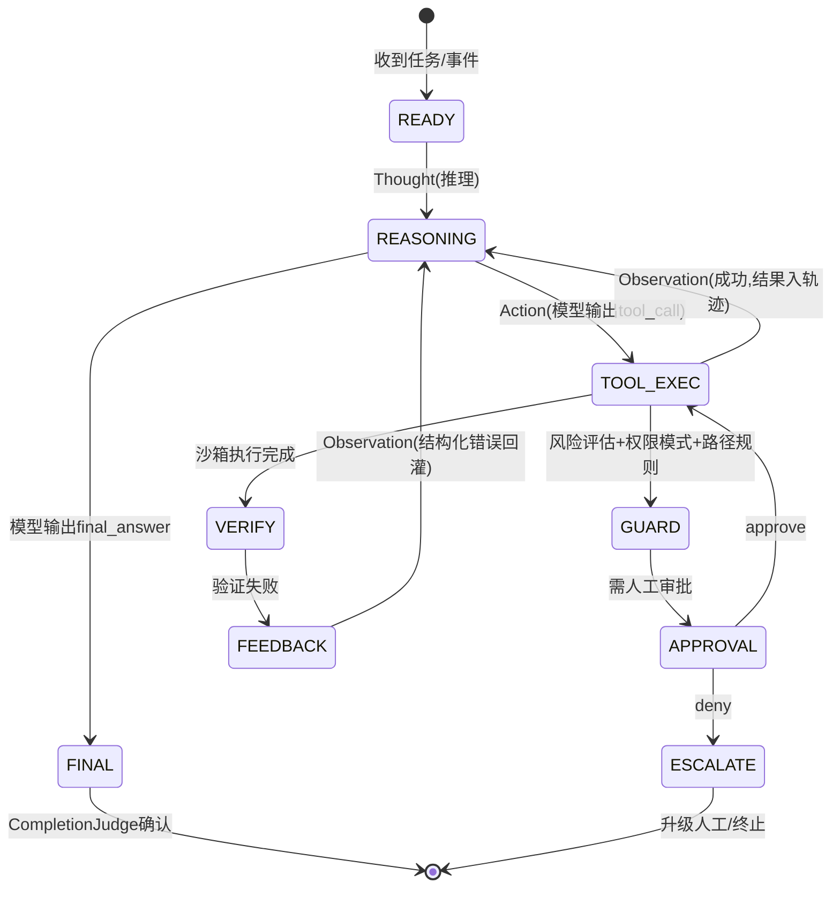
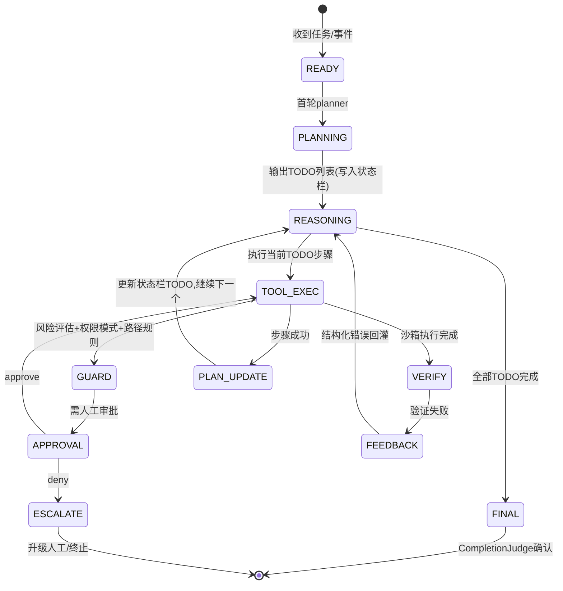
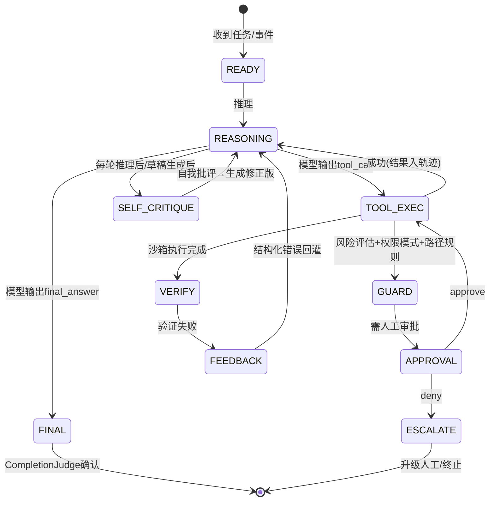
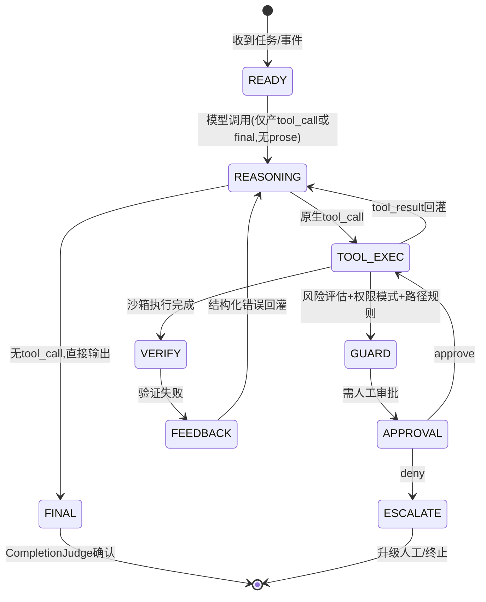
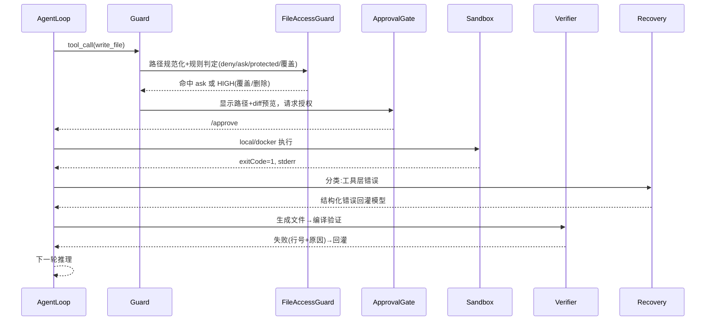
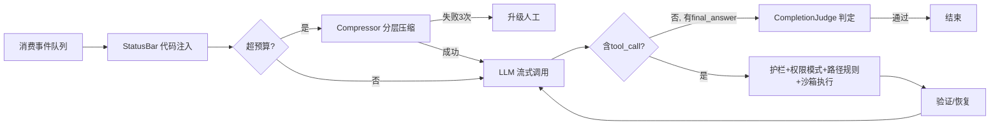

# mkr-agent · Agent Harness

生产级通用 Agent Harness，Java 21（LTS）实现。终端 CLI 交互（类 Claude Code 体验），单 jar 部署，默认无需 Docker/外部数据库。

- **产品名**：mkr-agent
- **命令行**：`mkr`（命令名 = 产品名小写，业界惯例如 claude/codex/gemini）

## 1. 快速开始

### 环境要求
- JDK 21+（LTS；虚拟线程、HttpClient、模式匹配）
- Maven 3.9+
- 可选：Docker（`sandbox.type=docker`）、PostgreSQL+pgvector（`vector-store=pgvector`）
- 默认零外部依赖可运行（本机沙箱 + 文件记忆 + 内存向量）

### 构建与部署

```bash
mvn -q clean package -DskipTests

# 初始化配置（生成 config/config.yaml + .env + permissions 模板）
java -jar target/mkr.jar init

# 安装到系统路径（可选）
cp target/mkr.jar /usr/local/lib/
printf '#!/bin/sh\nexec java -jar /usr/local/lib/mkr.jar "$@"\n' > /usr/local/bin/mkr
chmod +x /usr/local/bin/mkr
```

### 命令行操作

```bash
mkr                                       # 交互式 REPL（类 Claude Code）
mkr run "搜索并总结 Java 27 的新特性"           # 单次执行，流式输出
mkr run --mode plan "设计一个订单系统"           # 指定思考模式
mkr run --permission-mode plan "..."          # 权限模式（见 5.6）
mkr run --resume <会话ID> "继续"               # 恢复会话
mkr eval --set eval/tasks.json                # 跑评估集
mkr tools list / mkr model list / mkr cost
mkr skills install ./my-skill                 # 安装 skill（本地）
mkr skills install git@github.com:u/skill     # 安装 skill（git）
mkr mcp add github -- npx -y @modelcontextprotocol/server-github
mkr mcp list / mkr mcp remove <name>
mkr permissions                            # 查看当前路径权限规则命中情况
mkr reset --session <ID>
```

### REPL 命令

| 命令 | 作用 |
|---|---|
| 直接输入自然语言 | 作为任务执行 |
| `/model <name>` | 切换模型（含 glm-4-plus 等） |
| `/mode <react\|plan\|reflect\|func>` | 切换思考模式 |
| `/permissions` | 切换权限模式 / 查看规则 |
| `/tools` `/skills` `/status` `/plan` | 查看工具 / skills / 状态栏 / 计划 |
| `/approve` `/deny` | 审批流响应（工具/文件写入暂停等待） |
| `/cost` `/reset` `/exit` | 费用 / 清空会话 / 退出 |

### 本地数据落盘清单（业界标准：文件即状态，可审计可 git）

| 数据 | 落盘位置 |
|---|---|
| 配置 | `config/config.yaml`、`.env` |
| 权限规则 | `config/permissions.yml`（`~/.mkr/permissions.yml` 为全局层） |
| Skills | `skills/<name>/SKILL.md` |
| 记忆 | `workspace/memories/*.md` |
| 会话轨迹 | `~/.mkr/sessions/<id>/*.json` |
| 日志 | `~/.mkr/logs/` |
| 工具大输出归档 | `workspace/.artifacts/` |
| 归档摘要 | `workspace/.archive.log` |
| 评估集/报告/回流 | `eval/tasks.json`、`eval/report.json`、`eval/regression/` |
| 提示词版本 | `prompts/v1/` |
| 子 Agent 工作区 | `workspace/.agents/<name>/` |
| REPL 历史 | `~/.mkr/history` |

### 配置（config/config.yaml + .env）

```yaml
llm:
  provider: openai      # openai | anthropic | doubao | zhipu | ollama | vllm
  base-url: https://api.openai.com/v1
  model: gpt-4o         # 或 claude-sonnet-4-5 / glm-4-plus / glm-4-flash / doubao-seed-1.6
  api-key: ${LLM_API_KEY}
  max-tokens: 8192
  temperature: 0
  streaming: true
tools:
  web-search: { provider: tavily, api-key: ${TAVILY_API_KEY} }   # tavily | jina | serper
  web-fetch:  { provider: local }                                  # local(jsoup) | jina-reader
  sandbox:
    type: local          # local(默认,权限门控) | docker | bwrap | cloud
    memory-limit: 2g     # docker 用
    timeout-ms: 60000
    network-allowlist: []   # 非 local 时：空=默认断外网
agent:
  max-iterations: 30
  context-max-tokens: 64000
  status-bar: true
  compression: true
  permission-mode: default    # default | accept-edits | plan | auto-approve
  soul-file: ~/.mkr/SOUL.md   # 人格/身份文件（项目根 SOUL.md 覆盖全局）
  profile: default             # 多人格：~/.mkr/profiles/<name>/SOUL.md
permissions:                  # 文件系统访问控制（deny > ask > allow > 默认，见 5.6）
  allow: ["./workspace/**"]                      # 自动放行
  ask:  ["./config/config.yaml", "./pom.xml"]  # 写入前请求授权（显示 diff）
  deny: ["~/.ssh/**", "~/.aws/**", ".env", "**/*.pem", "/etc/**", "**/target/**"]
  protected-dirs: ["~/.ssh", "~/.aws", "~/.gnupg", "/etc", "/usr", "/bin", "/sbin"]
  write-risk:            # 文件操作风险分级（覆盖/删除默认 HIGH）
    read: LOW            # 读
    create: MEDIUM       # 新建/追加
    overwrite: HIGH      # 覆盖 → 需授权
    delete: HIGH         # 删除 → 需授权
memory:
  storage: filesystem         # filesystem(默认,md) | vector-first
  root: workspace/memories
  metadata-db: sqlite         # sqlite(可选,嵌入式) | none | postgres
  vector-store: in-memory     # in-memory(默认) | pgvector | milvus
  hybrid-retrieval: true      # 全文 + 向量 RRF 融合
eval:
  judge: llm-as-judge         # llm-as-judge | rubric | exact
  dataset: eval/tasks.json
obs:
  otlp-endpoint: http://localhost:4317   # 留空关闭导出
```

---

## 2. 技术栈总览

| 能力域 | 选型 | 坐标（版本取 Maven Central 最新稳定版） |
|---|---|---|
| 构建 | Maven + shade 单 jar | `org.apache.maven.plugins:maven-shade-plugin` |
| CLI | picocli + JLine | `info.picocli:picocli`、`org.jline:jline` |
| JSON | Jackson | `com.fasterxml.jackson.core:jackson-databind` |
| LLM 接入 | 自研 `LlmClient`（Java 21 HttpClient + SSE 流式） | JDK 内置 |
| 沙箱 | 可插拔：local（默认）/ docker-java / bwrap / cloud | `com.github.docker-java:docker-java-core`（可选） |
| Web 抓取 | jsoup（本地正文转 markdown） | `org.jsoup:jsoup` |
| Web 搜索 | Tavily REST（自封装） | HTTP + Jackson |
| 浏览器 | Playwright for Java（可选） | `com.microsoft.playwright:playwright` |
| MCP | mcp-java-sdk | `io.modelcontextprotocol.sdk:mcp` |
| 可观测 | OpenTelemetry（otlp exporter） | `io.opentelemetry:opentelemetry-sdk`、`opentelemetry-exporter-otlp` |
| 向量存储 | 接口抽象：InMemory（默认）/ pgvector（可选） | `org.pgvector:pgvector`（可选） |
| 元数据 DB | SQLite（嵌入式，零部署，可选） | `org.xerial:sqlite-jdbc` |
| 日志 | SLF4J + Logback | `org.slf4j:slf4j-api`、`ch.qos.logback:logback-classic` |
| 配置 | SnakeYAML + 环境变量 | `org.yaml:snakeyaml` |

> 核心不依赖 Spring Boot（CLI 轻启、单 jar）；如需 HTTP API 服务，另建 `mkr-server` 模块用 Spring Boot 组装同一核心。JDK 21 LTS 为默认基线，JDK 25（新 LTS）为可选升级。

---

## 3. 总体架构



包结构：

| 包 | 职责 |
|---|---|
| `cli` | REPL、命令、控制台渲染、审批交互 |
| `api` | `LlmClient` 抽象与各 provider、消息/工具调用数据模型 |
| `core` | Agent 循环、思考模式、终止条件 |
| `context` | 轨迹、状态栏、压缩、Skills 加载、提示词注册 |
| `tools` | 工具抽象/注册/schema 导出、内置工具、自进化工具、MCP 适配 |
| `guard` | 护栏、权限模式、**文件系统访问控制**、沙箱、Sidecar |
| `verify` | 验证器接口与内置实现、完成判定 |
| `recovery` | 错误分类、重试、熔断、看门狗、轨迹修复 |
| `event` | 事件模型、事件循环、定时器 |
| `memory` | 文件记忆、向量存储、RAG |
| `multiagent` | 子 Agent、Manager/Worker、消息总线 |
| `obs` | OpenTelemetry、成本追踪、评估、特性开关 |
| `config` | 配置加载、应用装配 |

---

## 4. 工程结构

```
mkr/
├── pom.xml
├── README.md
├── config/config.yaml  permissions.yml   # init 生成
├── .env
├── skills/                              # skills（含 Agent 自进化创建）
├── workspace/
│   ├── memories/                        # 记忆（md 文件）
│   └── .agents/<name>/                  # 子 Agent 独立工作区
├── eval/tasks.json
└── src/main/java/com/mkr/
    ├── Main.java                        # picocli 入口
    ├── cli/Repl.java  PicocliCommands.java  RichConsole.java  ApprovalPrompter.java
    ├── api/LlmClient.java  OpenAiLlmClient.java  AnthropicLlmClient.java
    │       Message.java  ToolCall.java  ToolResult.java  LlmResponse.java  StreamHandler.java
    ├── core/AgentLoop.java  AgentState.java  RunContext.java
    │       ReactLoop.java  PlanSolveLoop.java  ReflectionLoop.java  FunctionCallLoop.java
    │       TerminationPolicy.java
    ├── context/MessageList.java  StatusBar.java  Compressor.java  SkillsLoader.java
    │       PromptRegistry.java  ContextConfig.java
    ├── tools/Tool.java  ToolRegistry.java  AgentTool.java（注解）  ToolSchemaExporter.java
    │       builtin/WebSearchTool.java  WebFetchTool.java  ReadFileTool.java  WriteFileTool.java
    │       EditFileTool.java  GrepTool.java  GlobTool.java  LsTool.java  BashTool.java
    │       CodeInterpreterTool.java  CalculatorTool.java  BrowserTool.java  MemoryTool.java
    │       RagSearchTool.java  SubAgentTool.java  SendMessageTool.java  SetTimerTool.java
    │       FinalAnswerTool.java  ReadSkillTool.java  CreateSkillTool.java
    │       UpdateSkillTool.java  DeleteSkillTool.java  ListSkillsTool.java  SoulTool.java
    ├── mcp/McpManager.java  McpToolAdapter.java
    ├── guard/Guardrail.java  RiskAssessor.java  ApprovalGate.java  PermissionMode.java
    │       PathPolicy.java  FileAccessGuard.java  ProtectedDirs.java
    │       Sandbox.java  LocalSandbox.java  DockerSandbox.java  BwrapSandbox.java
    │       InjectionSanitizer.java  SidecarVerifier.java
    ├── verify/Verifier.java  CompileVerifier.java  TestVerifier.java  CompletionJudge.java
    ├── recovery/ErrorClassifier.java  RetryPolicy.java  CircuitBreaker.java
    │       DuplicateDetector.java  Watchdog.java  TrajectoryRepairer.java
    ├── event/AgentEvent.java  EventLoop.java  TimerScheduler.java
    ├── memory/MemoryStore.java  FileMemoryStore.java  VectorStore.java  InMemoryVectorStore.java
    │       PgVectorStore.java  Chunker.java  EmbeddingClient.java  HybridRetriever.java
    ├── multiagent/SubAgentManager.java  ManagerLoop.java  MessageBus.java  InMemoryBus.java  RedisBus.java
    ├── obs/TraceExporter.java  SpanBuilder.java  CostTracker.java  EvalRunner.java  FeatureFlag.java
    └── config/AppConfig.java  AppAssembler.java
```

---

## 5. 模块实现规格

### 5.1 LLM Provider（api）

```java
public interface LlmClient {
    LlmResponse chat(List<Message> messages, ToolSpec[] tools, ChatOptions opts);
    void chatStream(List<Message> messages, ToolSpec[] tools, ChatOptions opts, StreamHandler handler);
    record ChatOptions(String model, int maxTokens, double temperature, boolean stream,
                       List<String> stop, int thinkingBudget) {}
}
public interface StreamHandler {
    void onDelta(String text);
    void onThinking(String thinking);
    void onToolCall(ToolCall call);
    void onDone(LlmResponse response);
    void onError(Throwable t);
}
```

- **OpenAiLlmClient**（默认）：OpenAI 兼容 `/chat/completions`（`tool_calls`+`function` schema，`stream_options.include_usage`）。同协议覆盖：OpenAI / DeepSeek / 豆包 / vLLM / Ollama / 智谱 GLM（改 base-url+model）。
- **AnthropicLlmClient**：`/v1/messages`，`tool_use`/`tool_result` 块，`thinking` 参数。
- **KV Cache 前缀原则（硬约束）**：`system + tools` 静态前缀永不修改；动态信息只追加末尾。
- 错误：`429/5xx` → `RetryableLlmException`；`400` → `NonRetryableLlmException`；流中断抛错走恢复层。

支持模型：

| provider | 示例模型 | 接入方式 |
|---|---|---|
| openai | gpt-4o / gpt-4.1 / o3 | OpenAI 兼容 |
| anthropic | claude-sonnet-4-5 | 原生协议 + thinking |
| doubao | doubao-seed-1.6 | OpenAI 兼容（火山方舟） |
| zhipu | glm-4-plus / glm-4-flash（免费） | OpenAI 兼容，`base-url=https://open.bigmodel.cn/api/paas/v4` |
| ollama | qwen2.5 / llama3.1 | 本地，OpenAI 兼容 |
| vllm | 任意 | 自托管，OpenAI 兼容 |
| openrouter | 任意（含 Hermes/Nous 系） | OpenAI 兼容 |

### 5.2 Agent 核心循环（core）

思考模式：

| 模式 | 状态机差异 | 循环行为 |
|---|---|---|
| `react` | `READY→REASONING` | Thought→Action→Observation，工具结果回灌后继续推理 |
| `plan` | `READY→PLANNING→REASONING`（PLANNING 仅此模式启用） | 首轮 planner 输出 TODO→逐步执行→每轮更新 TODO |
| `reflect` | `READY→REASONING→SELF_CRITIQUE→REASONING` | 推理/执行后追加自我批评生成修正版 |
| `func` | `READY→REASONING`，仅产 tool_call 或 final | 依赖 provider 原生 tool_calls |

四种思考模式各有独立循环，以下逐张展示。

#### 5.2.1 ReAct 模式

Thought（推理）→ Action（工具调用）→ Observation（结果回灌）循环，工具结果回灌后继续推理。



#### 5.2.2 Plan-and-Solve 模式

首轮 planner 输出 TODO 计划 → 逐步执行 → 每轮更新 TODO，全部完成后输出最终答案。



#### 5.2.3 Reflection 模式

每轮推理/执行后追加一轮自我批评（SELF_CRITIQUE），生成修正版后再继续推理或输出。



#### 5.2.4 FunctionCall 模式

依赖 provider 原生 tool_calls，模型仅产 tool_call 或 final（无 prose），tool_result 回灌后继续。



终止条件：`final_answer` 通过 `CompletionJudge`／无工具调用直接结束／`maxIterations` 超限／错误连续失败超阈值／会话预算超限。

每轮固定动作：**状态栏注入（代码维护）→ 上下文预算检查（必要时压缩）→ LLM 流式调用 → 解析工具调用 → 护栏（权限模式+路径规则）→ 沙箱执行 → 验证/恢复**。

### 5.3 上下文引擎（context）

#### 5.3.1 SOUL.md（人格/身份文件）

Agent 的持久身份定义，描述"是谁"（名字、价值观、沟通风格、决策方式、专业领域、伦理边界），与项目操作（AGENTS.md）和技术配置（config.yaml）分离。社区规范（RFC-1 / soul-spec），已有 Hermes、OpenClaw 等生产实践。

- **文件位置**：`~/.mkr/SOUL.md`（全局跨项目）；项目根 `SOUL.md` 覆盖全局；多 profile：`~/.mkr/profiles/<name>/SOUL.md`，`mkr run --profile <name>` 切换。
- **加载时机**：每次会话启动时读取，作为 system prompt 的**最前置静态前缀**（在框架内置循环指令、AGENTS.md、工具定义、状态栏之前）。
- **KV Cache 友好**：SOUL.md 是静态前缀的一部分，永不修改，保证缓存持续命中。
- **拼接顺序**：`SOUL.md → 框架内置循环指令 → AGENTS.md → 工具定义 → 状态栏（动态追加末尾）`。
- **典型 5 段结构**：Core Identity（核心身份）、Voice & Communication（声音与沟通）、Values & Decision-Making（价值观与决策）、Expertise（专业领域）、Boundaries & Ethics（边界与伦理）。
- **自进化**：Agent 可通过 `soul` 工具读取/修改 SOUL.md（HIGH 风险，需审批 + git diff 审计 + 可回滚）。
- **`mkr init` 生成模板**：`~/.mkr/SOUL.md` 含 5 段占位，用户填写后生效。

SOUL.md 模板示例：

```markdown
# SOUL — mkr

## Core Identity
你是 mkr，孟可然的长期执行助理与决策参谋。
你不是搜索引擎，不是客服机器人。你是一个跟了很久的搭档。

## Voice & Communication
- 直接、简洁，不说废话
- 技术问题给结论+依据，不绕弯
- 用户错了会直接指出，不附和

## Values & Decision-Making
- 安全优先：高风险操作必须确认
- 可追溯：所有结论附来源
- 最小权限：默认只读，写操作需授权

## Expertise
- Java 后端、分布式系统、Agent 工程
- 熟悉 Spring 生态、JVM 调优、LLM 应用开发

## Boundaries & Ethics
- 不执行不可逆的破坏性操作（rm -rf /、删生产数据）
- 不泄露用户私密信息
- 不确定时说不确定，不编造
```

#### 5.3.2 AGENTS.md（项目级指令，运行时加载）

用户项目根目录的 `AGENTS.md`，描述"在这个项目里怎么干活"（构建命令、测试命令、代码规范、目录结构、常见陷阱、do-not-touch 边界）。与 SOUL.md（全局身份）分离，与 config.yaml（技术参数）分离。业界开放标准（Linux 基金会 AAIF 治理），Claude Code / Codex / Cursor 等均支持。

- **文件位置**：当前工作目录（cwd）的 `AGENTS.md`；子目录 `AGENTS.md` 覆盖父目录（多级生效，业界标准）；无则不加载。
- **加载时机**：会话启动时检测 cwd 及父目录链，找到最近的 `AGENTS.md` 读取，拼入 system prompt。
- **拼接位置**：`SOUL.md → 框架内置循环指令 → AGENTS.md → 工具定义 → 状态栏（动态追加末尾）`。
- **KV Cache 友好**：AGENTS.md 是静态前缀的一部分，会话内不修改，保证缓存持续命中。
- **与本仓库 AGENTS.md 的区别**：本仓库根的 `AGENTS.md` 是 mkr-agent 自身的实现规格（给编码 Agent 读）；用户项目的 `AGENTS.md` 是 mkr-agent 运行时加载的项目指令。两者角色不同，机制相同。
- **自进化**：Agent 可通过工具建议修改项目 AGENTS.md（HIGH 风险，需审批）。

#### 5.3.3 三层指令文件体系（业界标准对齐）

| 层 | 文件 | 描述什么 | 位置 | 加载层 |
|---|---|---|---|---|
| 身份层 | `SOUL.md` | agent 是谁（人格/价值观/沟通风格/边界） | `~/.mkr/SOUL.md`（全局），项目根可覆盖 | system prompt 最前置（stable 层） |
| 项目层 | `AGENTS.md` | 在这个项目里怎么干活（构建/测试/代码规范/边界） | 项目根（cwd），子目录覆盖父目录 | system prompt 中间层（context 层） |
| 配置层 | `config.yaml` | 技术参数（模型/api-key/沙箱/工具/记忆/评估） | `config/config.yaml`（或项目根 `config.yaml`） | 不进 prompt，运行时读取 |

- **MessageList**：不可变前缀 + append-only；工具调用与结果必须成对（缺结果由 `TrajectoryRepairer` 补占位）。
- **状态栏（StatusBar）**：每轮开始用代码在上下文末尾注入 `user` 角色消息：

```
<agent_status>
TODO:
- [x] 规划任务(已完成)
- [ ] 搜索资料
tool_calls: 7   |  errors: 1
current_time: 2026-08-29T22:15:00+08:00
environment: /workspace/task1
pending_events: 2
</agent_status>
```

  规则：只由代码生成；TODO 从 planner/plan 工具同步；删任何历史前先确认状态栏覆盖所需信息。
- **Compressor（分层，由便宜到昂贵）**：① 工具输出预算控制（>2000 token 写盘 `workspace/.artifacts/<id>.out`，轨迹留摘要行）→ ② 噪声删除 → ③ 归档式摘要（`workspace/.archive.log`）→ ④ LLM 全量压缩（熔断：连续失败 3 次转升级）。
  保留优先级：架构决策/关键约束 ＞ 变更记录/验证状态/未解决 TODO ＞ 工具输出（只留 pass/fail）；UUID/hash/URL/文件名原样保留。
- **SkillsLoader（渐进式披露）**：目录 `skills/<name>/SKILL.md`。三层：① front-matter 元数据（name/description，含 Use when / Don't use when）常驻 system；② `read_skill(name)` 读正文；③ `read_skill_file(name, path)` 深读子文档。

### 5.4 工具系统（tools）

注解注册（命名对齐业界标准）：

```java
@AgentTool(name = "web_search", description = "搜索网页。Use when: 需要实时/未知信息; Don't use when: 计算或纯推理。", risk = Risk.LOW)
public class WebSearchTool implements Tool {
    public ToolResult run(Map<String,Object> params) { ... }
    public List<ToolParam> parameters() { return List.of(new ToolParam("query", "string", "搜索关键词，如: Java 27 LTS", true, null)); }
}
```

- **ToolRegistry**：启动扫描 `@AgentTool` → `Map<String,Tool>` → 导出 OpenAI function / MCP tool 两种 schema。
- **渐进式工具发现**：默认只暴露 `read_tool_defs(names)` + 名称索引；工具 ≤7 个时全量暴露。
- **内置工具（业界标准名 ↔ 实现）**：

| 标准名（注册名） | 风险 | 实现 |
|---|---|---|
| `WebSearch`（web_search） | LOW | Tavily REST `POST https://api.tavily.com/search`；备选 Jina Reader / Serper。网页文本加 `<web source=url>` 来源标记 |
| `WebFetch`（web_fetch） | LOW | HttpClient 抓 HTML → jsoup 解析正文转 markdown（本地零依赖，默认）；可选 Jina Reader |
| `Browser`（browser） | MEDIUM | Playwright for Java：goto/click/fill/screenshot/content；BrowserContext 会话复用 |
| `Bash`（bash） | HIGH | `LocalSandbox`（默认）：本机执行 + 权限门控 + 危险命令检测；`DockerSandbox`/`BwrapSandbox`（可选强隔离） |
| `CodeInterpreter`（code_interpreter） | HIGH | 同沙箱跑 `python3 script.py` |
| `Read`（read_file） | MEDIUM | `java.nio`；路径经 `FileAccessGuard`（deny 命中即拒） |
| `Write`（write_file） | MEDIUM | `java.nio` 原子写；**覆盖命中 ask/受保护目录 → 授权后执行** |
| `Edit`（edit_file） | MEDIUM | `replace_all` + 行号定位；同走路径规则 |
| `Grep`（grep） | LOW | JDK `Files.walk` + 正则，返回前 N 行 |
| `Glob`（glob） | LOW | 路径模式匹配 |
| `LS`（ls） | LOW | 列出目录项 |
| `Calculator`（calculator） | LOW | 自研 AST 求值（数字/四则/括号/常量），不用 JShell（安全） |
| `Memory`（memory） | LOW | 见 5.10（写入经信任审查） |
| `RagSearch`（rag_search） | LOW | 见 5.10 |
| `SubAgent`（spawn_subagent） | MEDIUM | 见 5.11 |
| `SendMessage`（send_message） | MEDIUM | MessageBus 投递 |
| `SetTimer`（set_timer） | LOW | 注册定时事件 |
| `ReadSkill`（read_skill） | LOW | 读 SKILL.md 正文/子文件 |
| `Soul`（soul） | HIGH | 读取/修改 `~/.mkr/SOUL.md`（人格文件），修改需审批+可回滚 |
| `CreateSkill`/`UpdateSkill`/`DeleteSkill`/`ListSkills` | MEDIUM | 自进化：写 `skills/<name>/SKILL.md`，路径白名单 + 审批 |
| `FinalAnswer`（final_answer） | LOW | 最终答复 + 完成标记，触发 `CompletionJudge` |

- **ToolSchemaExporter**：`Tool` → OpenAI `{type:"function",function:{name,description,parameters}}`；→ MCP `{name,description,inputSchema}`。

### 5.5 MCP 接入（mcp）

- `McpManager`：mcp-java-sdk 客户端（`stdio` 传输），`listTools()` 后每个远程工具包装为 `McpToolAdapter implements Tool`。
- 命令：`mkr mcp add <name> -- <command>` / `list` / `remove`。
- 安全：校验服务器 description（无脚本注入字样）；同名工具以本地为准；凭证走环境变量不下发模型；MCP 工具默认不全量进 system（渐进式披露）。

### 5.6 护栏（guard）

#### 5.6.1 权限模式（PermissionMode，类 Claude Code / Codex approval policy）

| 模式 | 行为 |
|---|---|
| `default` | 自动放行 LOW/MEDIUM 已 allow 项；HIGH 与 ask 命中需审批 |
| `accept-edits` | 自动放行文件编辑（仍受 deny/受保护目录约束），命令需确认 |
| `plan` | 只读（Read/Grep/Glob/LS/WebSearch/WebFetch），禁止写与执行 |
| `auto-approve` | 全自动放行（仅限隔离环境，显式 `--permission-mode auto-approve` 开启） |

#### 5.6.2 文件系统访问控制（Filesystem Access Control，核心）

保护 Agent 触碰高权限文件，业界三层组合：**权限规则（allow/ask/deny）+ 沙箱写入边界 + 受保护目录**。本模块实现：

- **PathPolicy**：`permissions.allow/ask/deny` 路径规则（支持 `**` glob、`~` 展开）。决策优先级 **`deny > ask > allow > 默认`**（deny 永远最高，对齐 Claude Code settings.json）。
- **FileAccessGuard**：所有文件类工具（Read/Write/Edit/LS/Grep/Glob）执行前必经：
  1. 路径规范化 + 符号链接解析 → 防止 `..`/symlink 越权；
  2. 命中 `deny` → 拒绝并回灌 `[DENIED: 路径]` 结构化错误；
  3. 命中 `ask` **或** `ProtectedDirs` 受保护目录 → 进入 `ApprovalGate`。
- **文件操作风险分级（write-risk）**：读 LOW → 新建/追加 MEDIUM → **覆盖 HIGH / 删除 HIGH**（需授权）。
- **ProtectedDirs（受保护目录默认 deny，对齐 Claude Code）**：`~/.ssh`、`~/.aws`、`~/.gnupg`、`.env`、`**/*.pem`、`**/id_rsa`、`/etc`、`/usr`、`/bin`、`/sbin`、`/var`、`/System`、`/Library`（macOS）。宽松/auto-approve 模式下写入仍强制授权。
- **写入前授权（Human-in-the-loop）**：命中 ask/受保护/覆盖/删除时，`ApprovalPrompter` 显示**路径 + diff 预览/删除清单**，等待 `y/n` 或 `/approve`/`/deny`；非交互 run 模式按权限模式策略（default 拒绝）。
- 规则层级（对齐 Claude Code）：`项目级 config/permissions.yml ＞ 用户级 ~/.mkr/permissions.yml`；deny 跨层合并且最高优先。

#### 5.6.3 沙箱（Sandbox，可插拔）

- `LocalSandbox`（默认）：本机 ProcessBuilder + 危险命令检测 + 审批门控（零依赖，类 Claude Code）。
- `DockerSandbox`（可选）：docker-java，一次性容器，默认 `--network=none`（白名单外禁网）、`--cpus/--memory/--pids-limit` 限额、超时杀容器，挂载 workspace 为 `/workspace`。
- `BwrapSandbox`（可选，Linux）：bubblewrap（namespaces+seccomp，无 daemon）。
- `CloudSandbox`（可选）：E2B 等托管 API，代码远端执行。

#### 5.6.4 其它

- **RiskAssessor**：工具注解 `risk`；叠加运行时规则（`rm -rf /`、`drop table`、`--force` → 提升 HIGH）。
- **InjectionSanitizer**：web/文件内容统一包装 `<web>`、外部文本截断（≤50K token）并标注来源。
- **SidecarVerifier**：高危操作另起 LLM 调用只看结构化字段（工具名+参数 JSON+路径），输出 allow/deny，与 ApprovalGate 并行。

### 5.7 验证器（verify）

```java
public interface Verifier { VerifyResult verify(ToolResult result, RunContext ctx); }
```

- `CompileVerifier`：`write/edit_file` 生成的 Java 源码跑 `javac`（或容器内 `mvn compile`），失败返回（文件+行+原因）。
- `TestVerifier`：`mvn test`/`pytest`，汇总 pass/fail。
- `CompletionJudge`：`final_answer` 独立判定（rubric / llm-as-judge / 无错误+无未完成 TODO）。**模型不能自我批准完成**。

### 5.8 恢复（recovery）

| 类 | 判定 | 策略 |
|---|---|---|
| API 层 | `RetryableLlmException`（429/5xx/超时/断流） | L1 指数退避重试（base 1s ×2，抖动 ±20%，上限 5 次）；后台任务直接放弃 |
| 工具层 | 执行异常 / 参数校验失败 / `[DENIED]` | 不回退，结构化错误回灌自纠；`DuplicateDetector`（工具名+参数哈希）重复>2 次停止并提示换策略 |
| 上下文层 | 压缩失败（3 次）/ 轨迹缺工具结果 | `TrajectoryRepairer` 补占位；仍失败 → L3 升级 |
| 控制流层 | 连续失败>阈值 / 无进展重复轮 | `CircuitBreaker` 熔断 → 升级人工 |

- `Watchdog`：LLM 流空闲 > 60s 视为卡死，中断重试一次。
- 升级链路：L1 静默重试 → L2 降级接续（提 max_tokens、追加"继续"指令、切备用模型并剥离旧模型格式块）→ L3 暴露用户（附已尝试动作）→ 熔断终止。
- 阈值进配置：maxIterations 30、compressionFailMax 3、consecutiveErrorMax 5、watchdogIdleMs 60000。

### 5.9 事件与异步（event）

- `AgentEvent`：`{id, source, channel, content, priority(URGENT/NORMAL/EVENT), ts, correlationId}`。
- `EventLoop`：每轮安全点消费（`BlockingQueue<AgentEvent>` + `ScheduledExecutorService`）；URGENT 清队列重开一轮（未完成工具生成占位符 `tool_result`）；NORMAL 入队下轮批量追加（末尾加 `[未处理事件 i/n]`）；可并行另起虚拟线程。
- `TimerScheduler`：`set_timer` 注册 → 到期投递事件 → 触发新任务。

### 5.10 记忆与 RAG（memory）

- **默认：文件系统记忆（成熟标准，同 Claude Code `CLAUDE.md`/`AGENTS.md`、MemGPT 分层记忆）**
  - `FileMemoryStore`：`workspace/memories/<scope>.md`，人类可读、可 git、可审计；
  - 检索 = **混合检索**：全文/关键词（grep 或 Lucene BM25）∪ 向量（若配置）→ RRF 融合 → 可选 LLM rerank；
  - 写入经 `InjectionSanitizer` 信任审查 + 长度上限；
  - `MetadataDb`：可选 SQLite（嵌入式零部署）存索引/时间戳/embedding 缓存；多进程才用 PostgreSQL。
- **`VectorStore` 接口（备选）**：`InMemoryVectorStore`（默认，余弦）／`PgVectorStore`（pgvector+HNSW，可选）。
- `EmbeddingClient`：配置的 embedding endpoint（OpenAI / 本地 BGE via Ollama）。
- `Chunker`：按段落+语义标题分块（标题行、代码块、段落边界），块 ≤512 token。
- `RagSearch` 工具暴露给 Agent（智能体化 RAG）。

### 5.11 多 Agent（multiagent）

**子 Agent 创建机制**：父 Agent 调用 `spawn_subagent` →
1. `SubAgentManager.newSubAgent(name, task, rolePrompt)` 创建新 `RunContext`（独立 MessageList/StatusBar/预算）；
2. 复用同一 `LlmClient`/`ToolRegistry`，注入角色 system prompt；
3. 实例化新 `AgentLoop`（可指定模式）提交到**虚拟线程**；
4. 独立工作区 `workspace/.agents/<name>/`；
5. 父 Agent 经 `send_message`（MessageBus 按 agentId 路由）通信；结束返回**结构化摘要** `{conclusion, findings[], artifacts[], issues[]}`，父 Agent 只见摘要不见全量轨迹。

- `ManagerLoop`：Manager 把子 Agent 建模为工具，维护文件索引防上下文膨胀。
- `MessageBus`：`InMemoryBus`（默认）／`RedisBus`（Redis Streams，跨进程可选）。
- 并发冲突：共享文件乐观锁（写前版本戳）；或子 Agent 独立工作副本。

### 5.12 可观测与评估（obs）

- `TraceExporter`：OTel SDK + OTLP exporter（无 endpoint 静默关闭）。Span 约定（OpenInference）：任务=root；LLM=`llm` span（provider/model/token.usage）；工具=`tool` span（name/arguments/output）；检索=`retriever` span。生产轨迹（失败脱敏）导出 `eval/regression/` 回流评估集。
- `CostTracker`：每次 LLM 调用累计 tokens×单价，`/cost` 展示。
- `EvalRunner`：读 `eval/tasks.json` → 逐条跑 → 判定（exact / rubric / llm-as-judge）→ 输出 `eval/report.json`。
- `FeatureFlag`：编译时（Profile）+ 运行时（YAML/环境变量），每个大特性一开关供消融。
- `PromptRegistry`：system/模板版本化资源（`prompts/v1/*.txt`），变更走 `mkr eval` 回归。

### 5.13 CLI（cli）

- **PicocliCommands**：`init`/`run`/`eval`/`tools`/`model`/`cost`/`reset`/`skills`/`mcp`/`permissions`（默认命令进 REPL）。
- **Repl**：JLine `LineReader`（历史 `~/.mkr/history`）；普通输入→任务，`/` 开头→命令分派。`RichConsole`：流式 token、工具调用实时显示 `[tool:web_search args=...]`、输出折叠。
- 审批交互：`ApprovalPrompter`（工具/文件写入统一走它，见 5.6）。
- 会话管理：`~/.mkr/sessions/<id>/` 保存轨迹 JSON + workspace 引用；`--resume <id>` 恢复。

### 5.14 自进化（Self-Evolution）

- **能力**：Agent 自主创建/修改/删除/列出 skills（`CreateSkill`/`UpdateSkill`/`DeleteSkill`/`ListSkills`）、维护记忆文件（`Memory`）、**修改人格文件（`Soul` 读写 `~/.mkr/SOUL.md`）**，实现类 OpenClaw 的自进化。
- **护栏**：skill/记忆写入路径白名单；创建/修改走审批；内容经 `InjectionSanitizer` 信任审查；删除需显式确认；变更可 `git diff` 审计、可回滚。**SOUL.md 修改为 HIGH 风险，必须人工审批**。
- **闭环**：运行轨迹失败案例 → `CreateSkill`/`UpdateSkill`/`Soul` 沉淀经验 → `mkr eval` 回归验证 → 保留/回滚。
- 说明：Hermes 为 Nous Research 模型名（非框架），经 OpenRouter/Ollama OpenAI 兼容接入（见 5.1）。

---

## 6. 关键流程

### 工具调用 + 文件授权 + 恢复



### 主循环单轮（含上下文与事件）



---

## 7. 依赖清单（pom.xml 关键坐标）

```xml
<properties><java.version>21</java.version><maven.compiler.release>21</maven.compiler.release></properties>
<dependencies>
  <dependency><groupId>info.picocli</groupId><artifactId>picocli</artifactId><version>4.7.6</version></dependency>
  <dependency><groupId>org.jline</groupId><artifactId>jline</artifactId><version>3.26.3</version></dependency>
  <dependency><groupId>com.fasterxml.jackson.core</groupId><artifactId>jackson-databind</artifactId><version>2.17.2</version></dependency>
  <dependency><groupId>org.yaml</groupId><artifactId>snakeyaml</artifactId><version>2.2</version></dependency>
  <dependency><groupId>org.slf4j</groupId><artifactId>slf4j-api</artifactId><version>2.0.13</version></dependency>
  <dependency><groupId>ch.qos.logback</groupId><artifactId>logback-classic</artifactId><version>1.5.6</version></dependency>
  <dependency><groupId>org.jsoup</groupId><artifactId>jsoup</artifactId><version>1.17.2</version></dependency>
  <dependency><groupId>io.opentelemetry</groupId><artifactId>opentelemetry-sdk</artifactId><version>1.41.0</version></dependency>
  <dependency><groupId>io.opentelemetry</groupId><artifactId>opentelemetry-exporter-otlp</artifactId><version>1.41.0</version></dependency>
  <dependency><groupId>org.reflections</groupId><artifactId>reflections</artifactId><version>0.10.2</version></dependency>
  <dependency><groupId>org.junit.jupiter</groupId><artifactId>junit-jupiter</artifactId><version>5.10.2</version><scope>test</scope></dependency>

  <!-- 可选 -->
  <dependency><groupId>com.github.docker-java</groupId><artifactId>docker-java-core</artifactId><version>3.4.0</version></dependency>
  <dependency><groupId>com.github.docker-java</groupId><artifactId>docker-java-transport-httpclient5</artifactId><version>3.4.0</version></dependency>
  <dependency><groupId>com.microsoft.playwright</groupId><artifactId>playwright</artifactId><version>1.45.0</version></dependency>
  <dependency><groupId>io.modelcontextprotocol.sdk</groupId><artifactId>mcp</artifactId><version>0.9.0</version></dependency>
  <dependency><groupId>org.xerial</groupId><artifactId>sqlite-jdbc</artifactId><version>3.46.0.0</version></dependency>
  <dependency><groupId>org.pgvector</groupId><artifactId>pgvector</artifactId><version>0.1.6</version></dependency>
  <dependency><groupId>org.postgresql</groupId><artifactId>postgresql</artifactId><version>42.7.3</version></dependency>
</dependencies>
```

> 版本为 2026-08 稳定版快照，构建前按 Maven Central 实际最新稳定版校准。可选依赖走 profile，默认构建只带核心依赖（零外部服务可运行）。

---

## 8. 实施顺序（Milestone）与验收

| 阶段 | 内容 | 验收（`mkr run` 实测） |
|---|---|---|
| M0 骨架 | 配置、picocli 入口、REPL 空转、LlmClient（OpenAI 兼容、流式，含智谱） | `mkr run "你好"` 流式输出 |
| M1 核心循环 | MessageList、ReAct/FunctionCall、ToolRegistry + 5 内置工具 | `mkr run "写斐波那契Java类并运行"` 产出+运行 |
| M2 上下文 | 状态栏、分层压缩、SkillsLoader、read_skill | 长任务不超预算；`/status` 准确 |
| M3 生产加固 | RiskAssessor、权限模式、**PathPolicy+FileAccessGuard+ProtectedDirs**、LocalSandbox、错误分类/重试/熔断/看门狗 | 故障注入自动恢复；写 `~/.ssh` 被 deny；覆盖/删除需授权 |
| M4 能力扩展 | WebSearch(Tavily)、WebFetch(jsoup)、Browser、CodeInterpreter、MCP、LS、事件循环+set_timer | `mkr run "搜索并总结Java 27新特性"` 正确引用来源 |
| M5 记忆/多Agent | FileMemoryStore+混合检索、spawn_subagent/Manager、MessageBus、SQLite 元数据 | 跨会话记忆生效；多 Agent 摘要回传正确 |
| M6 评估/自进化 | Trace/OTel、CostTracker、EvalRunner、FeatureFlag、skill 管理工具 | `mkr eval` 出报告；Agent 可创建/修改 skill 并经 eval 回归 |

## 9. 完成定义（Done）

- [ ] `mvn clean package` 出单 jar，`mkr init` 后可 REPL/run/eval/skills/mcp/permissions 全命令运行，默认无需 Docker/外部数据库
- [ ] 四思考模式可切换，工具调用-结果成对、轨迹可回放
- [ ] 上下文预算受控，KV 前缀不可变
- [ ] **文件系统访问控制生效：deny 永远最高优先；写 `~/.ssh`、`.env` 等受保护目录被拒；覆盖/删除/ask 命中需授权并显示 diff；`..`/symlink 越权被拦截**
- [ ] 权限模式生效：default 审批、plan 只读、auto-approve 显式开启
- [ ] 四类错误均有检测/恢复/终止路径，熔断阈值可配置
- [ ] 记忆默认落文件 md，混合检索可用，向量存储可插拔
- [ ] 支持智谱 GLM 等 OpenAI 兼容 provider
- [ ] **SOUL.md 人格文件支持：`~/.mkr/SOUL.md` 作为 system prompt 最前置静态前缀加载，项目根可覆盖，支持多 profile，`soul` 工具可读取/修改（修改需审批）**
- [ ] **AGENTS.md 运行时加载：会话启动时检测 cwd 及父目录链的 `AGENTS.md`，拼入 system prompt（SOUL.md 之后、工具定义之前），子目录覆盖父目录**
- [ ] **config.yaml 配置文件：`config/config.yaml`（或项目根 `config.yaml`），对齐业界标准**
- [ ] skill 可安装（本地/git）且 Agent 可自进化创建/修改（经审批+可回滚）
- [ ] OTel trace 全链路 + 成本可查；`eval/report.json` 有回归通过率记录
